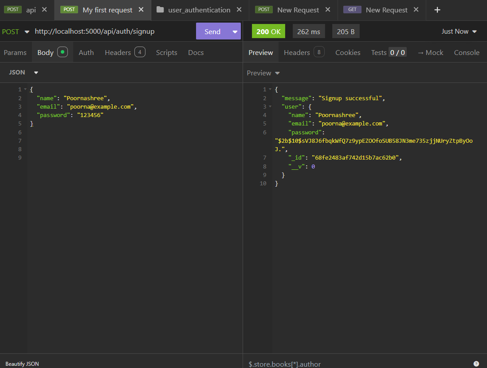
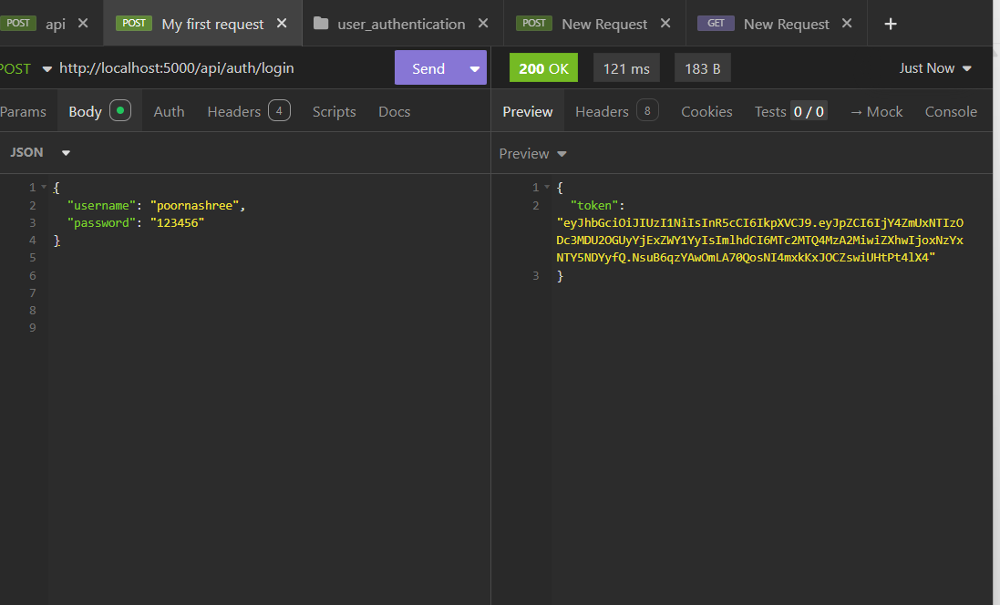
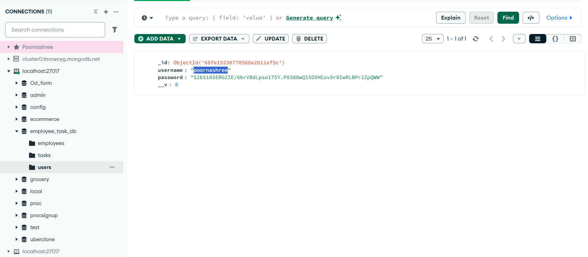
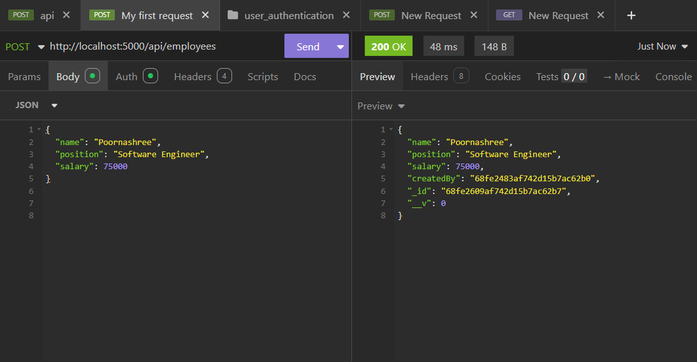
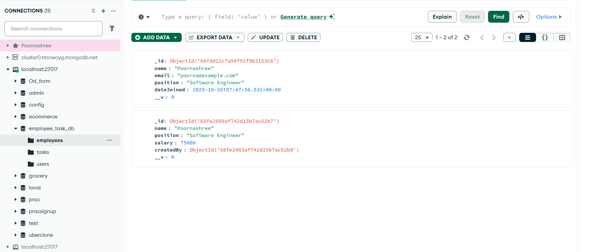
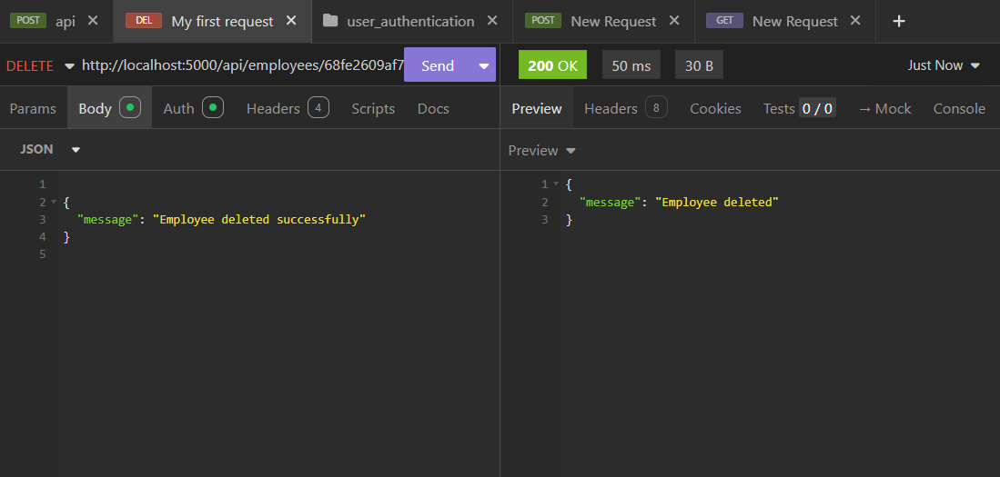
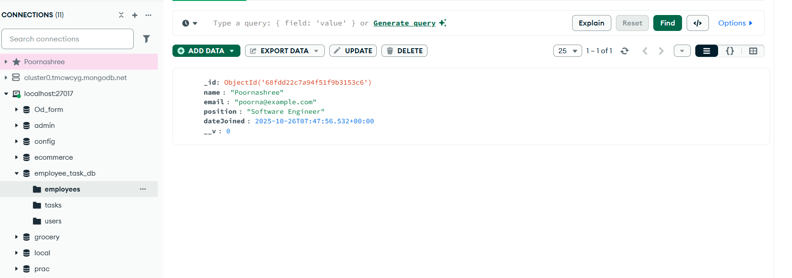

# Employee & Task Management API

##  Tech Stack
- Backend: Node.js + Express.js
- Database: MongoDB (Atlas)

## API Testing with Insomnia

Here are some screenshots of API testing using Insomnia:

## API Testing with Insomnia


### 1. Signup


### 2. Login


### 2. Login in mongodb


### 3. Add Employee


### 3. Update Employee in mongodb


### 4. Delete Employee


### 5. Delete Employee in mongodb



##  Setup Steps
1. Clone this repo  
   ```bash
   git clone https://github.com/Poornashree/employee-task-api.git
```
2. Install dependencies
```bash
cd backend
npm install
```

3. Start the server
```bash
npm start
```

API runs at: http://localhost:5000
